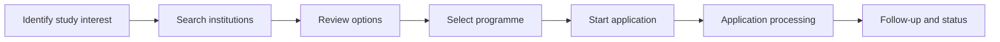
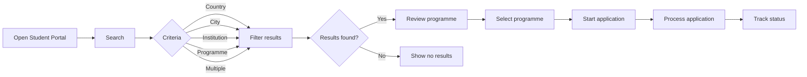

# Foreign Classroom — Process Analysis

## As-Is Process

The initial journey involved several activities and handoffs from identifying a study interest through application processing.

### Key As-Is Challenges

* Multiple steps between discovery and application
* Different user search behaviours
* Potential friction during information discovery
* Multiple operational handoffs
* Different workflow needs across user roles

---

## To-Be Process

The proposed experience provides a more structured journey from discovery through application and processing.

### BA Contribution

The process analysis focused on:

* Understanding the existing user journey
* Identifying process friction
* Mapping the desired future-state experience
* Defining search and workflow requirements
* Clarifying handoffs between users and operational teams
* Translating business needs into testable requirements

### Expected Improvement

The To-Be process creates a clearer journey:

**Discovery → Search → Evaluation → Selection → Application → Processing → Status Tracking**

The objective is to make the experience more structured for students while supporting clearer operational workflows.

---

## Business Analysis Perspective

The process redesign demonstrates how a Business Analyst can move from:

**Problem → Process Analysis → Requirements → Product Design → Testing**

rather than simply documenting what a system should do.
